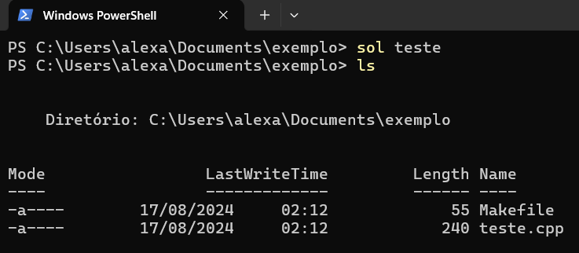

# O que é o Sol-cli? :computer:
É uma simples interface de linha de comando para criar arquivos de código em C++<b>
com um template voltado para competições de programação. O nome "Sol" veio da palavra "Solution" que significa "Solução" em português.

## Tecnologias Utilizadas :pushpin:
- [C#](https://learn.microsoft.com/en-us/dotnet/csharp/) (Linguagem de programação)<br>
- [.NET 8.0](https://dotnet.microsoft.com/en-us/download/dotnet)<br>

## Como instalar o Sol-cli :white_check_mark:
1. Instale o **.NET 8.0** através desse [link](https://dotnet.microsoft.com/en-us/download/dotnet/8.0)
2. Faça o clone desse [repositório](https://github.com/AlexandreDantasz/Sol-cli) na sua máquina:
    - Crie uma pasta no seu computador para esse programa.
    - Abra o `git bash` ou `terminal` dentro dessa pasta.
    - Digite `git clone https://github.com/AlexandreDantasz/Sol-cli` e pressione `enter`
    - Copie o caminho absoluto do arquivo "template.cpp".
    - Abra o arquivo Program.cs e cole o caminho dentro das aspas da linha 11 do arquivo.
3. Instale a ferramenta globalmente
    - Ainda no terminal, entre na pasta do projeto executando o comando `cd Sol-cli`
    - execute os seguintes comandos: `dotnet pack` e `dotnet tool install --global --add-source ./nupkg sol.cli`

## Como usar?
Em qualquer terminal, basta digitar `sol <nome do arquivo>` e pressionar `enter`.
Após isso, serão criados: um arquivo de código c++ com o nome passado por parâmetro e um arquivo Makefile.

Exemplo: <br>



### Forma do arquivo Makefile
```
    exec: main
        ./main.exe
    main:
        g++ <nome do arquivo>.cpp -o main.exe
```

O arquivo Makefile especifica como o arquivo de código criado pelo usuário deve ser compilado e executado.  

OBS: Caso o usuário deseje compilar o código de outra forma, basta alterar o arquivo Makefile ou compilar de outra maneira.

- Certifique-se de que não há nenhum arquivo existente no mesmo diretório com o mesmo nome e com a extensão ".cpp" e um arquivo "Makefile".